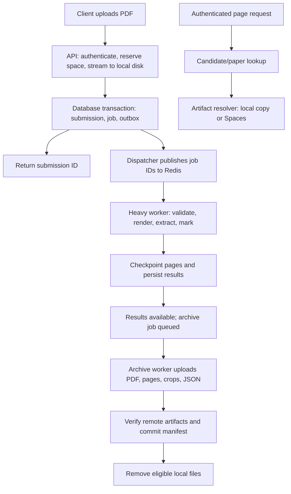

# Exam-season queue, large uploads, and Spaces implementation plan

Prepared: 19 September 2026. Status: implemented and deployed on 19 September 2026. The original design below is retained as rationale; the rollout notes and API guide describe the shipped configuration.

## 1. Scope and decisions

Implement a durable processing queue, support PDF files up to **3 GiB (3,221,225,472 bytes)**, archive processed submissions and their images to DigitalOcean Spaces, and retrieve a candidate's scanned page using their candidate number and existing paper code. The 3 GiB choice continues the current binary size convention and accepts decimal 3 GB files too; publish the exact byte limit in the API.

Updated 20 September 2026: page lookup accepts external `exam_id=31` for the complete SEAMO 2026 series, without answer keys. Paper codes remain supported for compatibility; the original paper-code design below records the initial plan. External ID 31 is independent of the older `/exams` database IDs.

Recommended first deployment:

- Celery with Redis for dispatch, retries, and separate worker processes.
- A database job ledger and transactional outbox as the authoritative record of accepted work.
- One heavy worker execution slot on the existing server, retaining bounded page-level parallelism. A separate archive worker handles storage transfers.
- Keep SQLite/WAL during the first, single-host rollout; use short transactions and atomic conditional claims. Move to PostgreSQL before increasing processing replicas or adding worker hosts.
- Continue receiving files on this server. Upload artifacts to Spaces after processing, verify them, then remove eligible local copies.
- Preserve the existing upload/poll/results contract. Add queue and archive information without changing existing status values.

These choices improve reliability and keep the API responsive. They do not increase the Gemini quota or promise that one server can drain an unlimited backlog.

## 2. Verified pre-rollout starting point

| Area | Pre-rollout behavior / implication |
| --- | --- |
| Host | 4 vCPUs, approximately 7.5 GiB RAM; approximately 60.1 GiB free on the 99.9 GiB storage filesystem at inspection |
| Processing | `/upload` schedules a synchronous function using FastAPI `BackgroundTasks`; work belongs to the API process and does not have durable queue recovery |
| Limits | API container capped at 3 CPUs; extraction parallelism 6, render/OCR parallelism 3, Gemini limit 60 calls/minute |
| Upload size | nginx configured for a 1 GiB request body; application size setting is not enforced; browser file picker has a separate 50 MiB limit |
| Upload implementation | Framework multipart parsing followed by another local file copy; current synchronous copy occurs inside an async route |
| Images | Conversion creates all page images; the extraction handler deletes them in `finally`; page previews are subsequently re-rendered from the local PDF |
| Marking | Stale-run recovery can fail runs older than five minutes based on start time; this must become lease-aware for long jobs |
| Storage | PDFs, JSON and diagram crops are local. No Spaces configuration or credentials are present |
| Candidate identity | `CandidateResult` already has candidate number, per-page template ID, submission ID, and original page number |
| Other compute routes | Synchronous extraction, re-marking, review-triggered re-marking, and the older `/exams` extraction flow must not bypass the new processing budget |

## 3. End-to-end architecture



Only IDs and small scheduling metadata go into Redis. PDFs, images, candidate answers, and large results stay in local storage, Spaces, and the application database. The first release's API and workers share the same persistent host storage volume; remote workers cannot use these local paths without an explicit transfer/shared-storage design.

### Durable acceptance and recovery

1. Reserve upload capacity before consuming the large body. Stream into a unique `.part` file on persistent storage while counting bytes and hashing.
2. Flush and `fsync` the file, then atomically rename it to its final local path and sync the containing directory.
3. In one database transaction, create the submission, processing job, and outbox row. Return the existing HTTP 200 upload envelope with `submission_id` only after acceptance is durable.
4. A dispatcher publishes committed outbox entries to Redis and retries failed publication. If Redis is briefly unavailable, already accepted jobs remain discoverable in the database.
5. A reconciler detects unpublished, missing, or expired work and reschedules it. Duplicate delivery is expected; workers must claim a job atomically before doing work.
6. On a crash between the filesystem rename and database commit, an age-based orphan scanner recovers or removes unreferenced files. It must exclude live upload reservations.

Use SQLite `synchronous=FULL` for durable acceptance rather than retaining the current `NORMAL` setting without review. The initial design survives process/host restarts with intact persistent storage; permanent disk loss also requires backups of the database and unprocessed local PDFs. Post-processing archival alone cannot protect files that have not yet reached Spaces.

Add optional `Idempotency-Key` to `/upload`. Store its association with the submission and payload hash. A retry with the same key and identical content returns the original submission; conflicting content returns 409. An in-progress upload reservation must also be recoverable. An early replay before the body is received requires a declared checksum that the first upload verifies; do not claim to compare unseen bodies.

### Queue policy and resources

- Start with `worker_concurrency=1` for heavy tasks, prefetch 1, and late acknowledgments. Preserve OCR slots 3, OpenMP threads 1, and bounded extraction calls. Celery documents how late acknowledgments and prefetch control reservations; tasks must tolerate replay. [Celery worker configuration](https://docs.celeryq.dev/en/main/userguide/optimizing.html)
- Separate `process`, `mark`, and `archive` queues. One heavy worker consumes process/mark work under a common budget; archive transfers have a separate, bounded worker.
- First release: FIFO across submissions with a visible queue state. Before enabling 3 GiB support, split long processing into checkpointed page batches, initially around 10 pages, and schedule eligible batches fairly across submissions. Limit outstanding batches per submission to prevent one enormous PDF from monopolizing Redis.
- No worker may synchronously wait for child tasks in its own pool. The dispatcher schedules the next stage when prerequisite checkpoints commit.
- Move the Gemini limiter to Redis so extraction, marking, retries, and any additional workers collectively respect the configured 60 calls/minute. Pause provider calls if the shared limiter is unavailable; do not fall back to unlimited calls.
- Redis uses persistent storage, AOF, a bounded memory allocation with `noeviction`, and an internal network connection. The database ledger can reconstruct dispatch after broker loss.
- Divide CPU/memory limits across API, heavy worker, archive worker and Redis. Do not give every new container the current 3-CPU allocation. Preserve host/API headroom; benchmark the exact split before increasing concurrency.

### Leases, cancellation, retries and checkpoints

- Record worker ownership, heartbeat, lease expiry, attempt count and a monotonically increasing claim generation. Every result commit must check the claim generation so an expired worker cannot overwrite newer results.
- Replace age-only marking recovery with lease/heartbeat checks. Polling a healthy long-running job must never mark it failed.
- Enable worker-loss redelivery with a database attempt cap; poison/OOM jobs must eventually become failed instead of cycling indefinitely. Celery explicitly warns that worker-loss requeueing can cause loops. [Celery acknowledgment settings](https://docs.celeryq.dev/en/stable/userguide/configuration.html#std:setting-task_reject_on_worker_lost)
- Set execution deadlines and Redis visibility timeouts together, per bounded work unit. Do not put a many-hour PDF into a task with Redis's default one-hour visibility timeout. Keep long retry schedules in the database rather than holding large numbers of distant-ETA messages. [Celery Redis transport](https://docs.celeryq.dev/en/stable/getting-started/backends-and-brokers/redis.html)
- Retry transient network/provider errors with bounded exponential backoff and jitter; initial policy: three attempts per work unit. Corrupt/password-protected/unsupported PDFs become explicit validation failures. Archive retries do not repeat extraction or AI marking.
- Persist page extraction checkpoints and per-candidate marking checkpoints. Add uniqueness constraints for the actual extraction unit, such as `(submission_id, source_page, candidate_index)`, and upsert on replay. Do not duplicate candidates, immutable marking runs, or archive manifests.
- A provider call interrupted before its response is checkpointed may be repeated and billed again. Promise replay-safe database results, not exactly-once external AI execution.
- Preserve existing cooperative cancellation. Cancelled pending jobs never begin; active workers stop at checkpoints. Cancelling processing must not race into completion or local cleanup. Cancelling a later marking job needs its own job cancellation handle, since the existing endpoint rejects completed submissions.
- Keep failed/cancelled sources and completed checkpoints available for diagnosis/retry under an explicit retention policy. Do not delete them merely because processing failed.

## 4. Supporting 3 GiB uploads safely

### Enforce the same limit throughout

| Layer | Planned change |
| --- | --- |
| nginx | Raise the request-body limit to `3080m`, allowing a 3072 MiB PDF plus bounded multipart overhead; scope streaming settings to upload routes |
| Application | Enforce a 3,221,225,472-byte file limit while receiving the file, regardless of `Content-Length`; return 413 and clean partial uploads when exceeded |
| Multipart parser | Keep the existing `file` field contract, but stream directly into the final-volume staging area; bound non-file fields and allow only one PDF per `/upload` |
| Proxy buffering | Disable request-body buffering on this route and use a compatible upstream HTTP configuration; test chunked requests so nginx does not silently retain a second full copy |
| Frontend | Replace the 50 MiB validator and text; derive limits from a small `GET /capabilities` response instead of another hard-coded constant |
| Timeouts | Replace the browser's fixed 30-minute ceiling with a configurable large-upload budget; retain an inactivity timeout and explicit user cancellation |
| Clients | Preserve progress reporting, return a useful 413/429/503 message, and document interrupted-upload reconciliation using the idempotency key |

nginx applies its size limit to the complete request body, while `client_body_timeout` concerns gaps between reads, not total upload duration. Request buffering otherwise receives the complete body before proxying it. [nginx size and timeout directives](https://nginx.org/en/docs/http/ngx_http_core_module.html#client_max_body_size), [nginx request buffering](https://nginx.org/en/docs/http/ngx_http_proxy_module.html#proxy_request_buffering)

Raising nginx alone is insufficient: the current parser/copy path can consume multiple copies' worth of disk space and block API responsiveness. Size/auth/admission checks need to run before normal multipart dependency parsing has already spooled the body. Never use `await file.read()` without a bounded size.

### Disk admission and rendering

- Initial proposed policy: at most two incoming large uploads at a time; preserve at least 20 GiB of free disk. These are starting settings, not tested capacity claims. Maintain atomic reservations so concurrent requests cannot each claim the same free space.
- Account separately for received PDFs, active upload reservations, rendered page images, diagram crops, archive backlog, cache, and safety reserve. Queue length alone is insufficient; cap accepted outstanding bytes as well.
- Validate page count, page dimensions and expected raster size before rendering. Add configurable page/pixel/workspace limits and set their production values from large-file testing. A 3 GiB byte allowance is not a promise to accept arbitrarily many or arbitrarily large pages.
- Render/extract in bounded page batches. Preserve original one-based PDF page numbers, including skipped/blank pages. Do not keep the entire document's decoded images in RAM.
- Because the requested archive happens after processing, all retained conversion images still need disk until that point. Reserve a conservative workspace budget; stop safely before the disk floor if actual growth exceeds it. Moving to batches bounds memory, not retained-image disk usage.
- On admission saturation return 429 with `Retry-After`; on insufficient disk or unavailable infrastructure return 503 with a stable error code. Keep polling, cancellation, completed-result reads and archiving available.
- Interrupted uploads have expiry/cleanup and cannot create runnable jobs before completion. Resumable chunk-upload sessions are a later extension if client connections make single-request 3 GiB uploads unreliable; they are not silently implied by multipart form support.

Do not enable the production 3 GiB switch until bounded rendering, disk admission, and archive handling pass the acceptance tests.

## 5. Archive to Spaces after processing

### Artifact contract

Preserve and archive:

1. Original uploaded PDF, unchanged.
2. Every converted source-page image, including blank/unclassified pages, in original page order.
3. Persisted per-question diagram crops used for marking.
4. Original extraction JSON and a versioned marked export when complete marking exists.
5. A machine-readable manifest linking page numbers, artifact IDs, sizes, hashes, object keys, and result/marking revisions.

The database remains the authority for current candidate edits and scores. Archive a new result revision after correction/re-marking; a previously archived export is an immutable historical snapshot. Shared answer-key reference images stay as separately managed reference assets, rather than copying them into every submission.

Example object names (no candidate names or numbers in object keys):

```text
submissions/123/source/original.pdf
submissions/123/pages/v1/000001.png
submissions/123/diagrams/v1/page-000001-question-12.png
submissions/123/results/extraction-v1.json
submissions/123/results/marking-run-456.json
submissions/123/manifests/revision-1.json
```

### Copy, verify, then remove locally

1. Processing reaches its terminal outcome and commits candidates/results. Successful extraction can still have unavailable/failed marking; archive the source, images and available results regardless, without falsely claiming a marked export exists.
2. Queue archive work independently. Expose `archive_status` separately from processing/marking status so results remain available during transfer or an archive outage.
3. Use private Spaces objects and bounded multipart transfers for large PDFs. Persist upload IDs and completed parts if resuming across worker restarts; a simple SDK multipart call alone does not provide application-level restart recovery. The Spaces origin API supports multipart operations. [Spaces multipart API](https://docs.digitalocean.com/reference/api/spaces/#advanced-object-uploads)
4. Verify byte count and integrity using the supported server-validated checksum mechanism. Test the actual Spaces endpoint's checksum behavior. If a suitable end-to-end checksum is unavailable, stream the object back to hash it before local eviction. Multipart ETags must not be treated as a plain-file MD5, and echoed custom SHA metadata alone is not content verification.
5. Commit verified per-artifact locations and the completed manifest to the database.
6. Only then mark local copies eligible for deletion. Retain a bounded, configurable cache—initial target up to 24 hours, evictable earlier after verification under disk pressure. Pin files while extraction, marking, image reads or downloads use them.
7. If upload/verification fails, retain local files, expose the failure, retry and alert. Never delete the only verified copy. Partial multipart uploads are aborted or resumed; completed objects with an uncommitted manifest are reconciled on replay.

For failed/cancelled jobs, retain source and partial artifacts initially; a recovery policy may archive them with an explicit incomplete manifest before local eviction. Never present that archive as a successfully processed submission.

### Read and delete compatibility

Introduce one artifact resolver for local and Spaces-backed files. Update raw JSON downloads, page images, diagram images, manual re-marking and deletion to use it. Remote crops needed by marking are fetched into a bounded local cache and pinned for the job.

Keep page images as individual objects: requesting one candidate's scan must not require downloading a 3 GiB PDF. Serve an authenticated streaming PNG response through the API initially, preserving the same contract regardless of storage location. Optional short-lived signed URLs can be added later as an explicit alternative.

Deletion becomes a tombstoned cleanup job that covers local files, remote objects and incomplete multipart uploads; coordinate with active jobs/readers so archive retries cannot resurrect deleted artifacts. Retention and bucket lifecycle rules must not remove originals or pages still referenced by live submissions.

Required from the operator: Spaces origin endpoint, region, bucket, access key and secret with suitable object read/write/delete and multipart permissions. Configure secrets only on the server. An application API key is not a Spaces credential. Bucket backup/retention is a separate decision: Spaces does not provide built-in backups. [Spaces limits and capabilities](https://docs.digitalocean.com/products/spaces/details/limits/)

## 6. Candidate and exam page-image endpoint

Proposed endpoint:

```http
GET /candidate-page?exam_id=seamo_x_2026_b&candidate_number=000123
X-API-Key: <existing application API key>
```

| Input | Requirement |
| --- | --- |
| `exam_id` | Required string; validated existing paper code, not legacy integer `/exams` ID |
| `candidate_number` | Required string; trim outer whitespace, preserve leading zeros; no fuzzy numeric coercion |
| `submission_id` | Optional integer to disambiguate re-uploads or duplicate candidate numbers |
| `page_number` | Optional one-based original PDF page number if multiple pages remain within the selected submission |

Resolve candidates using their **per-page paper identity**, not the submission's forced template, since auto-detected submissions can contain multiple papers. Introduce an explicit paper identity mapping for layout variants where necessary. Do not infer paper equivalence from geometric `variant_of` or answer-key alias fields: those can link different papers.

Success: HTTP 200, `Content-Type: image/png`, full converted source-page image. Include `X-Submission-ID`, `X-Candidate-ID`, `X-Page-Number` and `Cache-Control: private` metadata. The same output works before and after Spaces archiving. Diagram crop endpoints remain separate.

Resolution rules:

- Unique match: return its page.
- No matching candidate/paper: 404. Unknown paper code or malformed inputs: 422.
- Multiple matching submissions/pages: 409 with a machine-readable code and matching submission/candidate/page IDs. The client must select one; never silently choose the latest scan.
- A supplied discriminator must belong to the matching candidate and paper; it cannot be used to retrieve an arbitrary page.
- Known page awaiting rendering: 409 with `page_not_ready`; storage temporarily unavailable: 503; permanently missing retained artifact: 410.
- Missing/unread candidate numbers are excluded until corrected. Corrections update the lookup index transactionally.

Example ambiguous response:

```json
{
  "detail": {
    "code": "ambiguous_candidate_page",
    "message": "Provide submission_id and, if needed, page_number.",
    "matches": [
      {"submission_id": 123, "candidate_id": 701, "page_number": 4},
      {"submission_id": 124, "candidate_id": 755, "page_number": 9}
    ]
  }
}
```

Add a composite candidate lookup index. Older submissions can initially use their retained PDF to generate and persist the requested page; background backfill builds page artifacts for remaining historical submissions without competing aggressively with current exams.

## 7. Database and API changes

| Record | Main fields / constraints |
| --- | --- |
| Processing job | submission, kind, state, stage, attempts, available_at, owner, heartbeat, lease expiry, claim generation, error code; unique active logical work unit |
| Outbox event | unique event/job identity, payload reference, published_at, publication attempts |
| Page checkpoint | submission, original page number, extraction unit index, stage, revision, artifact references; uniqueness for replay-safe writes |
| Artifact | submission/page/candidate/run references, kind, local path, remote key, bytes, SHA-256, verification state, upload ID/parts, local eviction state |
| Archive manifest | submission, revision, complete/incomplete status, artifact set, committed_at |
| Upload reservation | idempotency key, byte reservation, staging path, expiration, source checksum, submission link |
| Candidate lookup | paper code and normalized candidate string, indexed with submission/page identity |

Use versioned database migrations and a tested restore path rather than adding more ad-hoc schema changes at every API startup. For the initial SQLite release, use conditional-update claims and very short transactions; do not assume PostgreSQL-only locking syntax works on SQLite. Each forked worker opens its own database connections.

Preserve `pending`, `processing`, `completed`, `failed`, and `cancelled` submission statuses. Add optional fields to `/status/{id}`:

```json
{
  "status": "pending",
  "stage": "queued",
  "queue_position": 7,
  "pages_completed": 0,
  "pages_total": null,
  "attempt": 0,
  "archive_status": "not_started",
  "archive_error": null
}
```

This is a partial example of added fields; existing fields remain. Queue position is an estimate under retries/fair scheduling, not a completion-time guarantee. `completed` continues to mean the extraction/automatic-marking attempt is terminal; inspect marking state as today. Archival may still be pending.

Add explicit async marking job support, including job status/cancellation. Existing synchronous marking/extraction callers should retain their response shapes through wrappers that enqueue and wait for a bounded period; on timeout they need a recoverable job reference and documented response. Do not silently replace an existing synchronous 200 response with 202. Audit all compute routes before declaring the concurrency limit enforced.

The UI displays queued/processing stages, page progress, cancellation, and archive status, and consumes the capabilities endpoint for upload limits. Update the integration guide, OpenAPI, sample client and executable response fixtures together.

## 8. Rollout sequence and acceptance gates

| Phase | Deliverable | Gate before next phase |
| --- | --- | --- |
| 1. Queue foundation | Job ledger/outbox, Redis, worker, lease-aware recovery, cancellation, status/UI changes; current file-size limits retained | Worker/API/broker restart tests and duplicate-delivery tests pass; existing 100-page input succeeds |
| 2. Bounded pipeline and storage | Page batches/checkpoints, retained page artifacts, artifact resolver, archive worker and candidate-page lookup | Mixed-paper and duplicate-number lookup tests pass; simulated Spaces failures never lose local artifacts |
| 3. Spaces activation | Configure supplied credentials, run a small canary through upload/verify/evict/readback | PDF/pages/crops/results remain usable after local eviction; re-marking and deletion work remotely |
| 4. Large-file release | Streaming upload, file-byte enforcement, disk reservations, frontend/proxy/capabilities limits | Real near-3-GiB valid PDF and multi-upload load tests pass with measured RAM/disk headroom |
| 5. Operational tuning | Backfill archives, queue-age alerts, throughput metrics and measured concurrency adjustment | Sustainable incoming pages/hour does not exceed measured processing capacity |

Before each production deployment: snapshot the database consistently, back up configuration, pause new dispatch, drain or checkpoint active work, apply additive migrations, then run canaries. New submissions use one processing path only; never leave both `BackgroundTasks` and queue dispatch active for them. Rollback pauses new admission/dispatch and preserves accepted queued jobs; it must not rerun them through the old background path.

Do not roll back to local-only readers after remote eviction starts. Storage-aware readers must remain deployed, or affected artifacts must first be restored locally. Deploy readers before enabling archival eviction.

Credentials are the only external input needed to activate real Spaces transfers. Queue/storage code and simulated integration tests can be implemented before they arrive. The disk-aware admission policy remains active if Spaces is unavailable.

### Acceptance tests

1. Concurrent uploads return separate IDs and remain responsive; execution respects the heavy-worker and provider budgets.
2. A 20-submission mixed-size burst completes without duplicate candidates; small jobs progress at bounded-batch boundaries.
3. Kill the API, heavy worker, archive worker and Redis at separate stages; all durably accepted jobs recover or reach an explicit terminal error.
4. Replay duplicate messages and upload idempotency keys; verify stable candidate IDs and no duplicate committed grading runs.
5. Cancel queued and active processing; verify cancellation survives restart and cannot be overwritten by completion.
6. Test a valid PDF just below the exact byte limit and rejection above it, including requests without trustworthy Content-Length. Verify bounded memory and clean partial-file removal.
7. Test disk reservation contention, enormous page dimensions and expanded raster storage; the filesystem never crosses the reserved safety floor.
8. Run a real representative large-file soak test, not only padded synthetic bytes. Record wall time, provider calls, p95 API latency, peak RSS and peak disk.
9. Interrupt multipart archives, simulate a bad checksum and Spaces 403/503 errors; no local eviction before verified manifest commit.
10. Retrieve original page images and diagram crops after eviction; confirm pixel/file hashes and page mapping, including blank pages.
11. Correct candidate number or re-mark after archive; lookup and fresh result exports update while historical manifests remain immutable.
12. Test same candidate number in different papers and in repeated submissions of the same paper; ambiguity returns 409 instead of the wrong student's scan.
13. Exercise legacy JSON/image/download/delete/synchronous routes to catch local-path assumptions and queue bypasses.

### Monitoring and capacity decisions

Track oldest queued-job age, admitted bytes, jobs/pages completed per hour, heartbeat age, retries, provider pacing/errors, worker RSS/CPU, free and reserved disk, archive backlog bytes/age, checksum failures and upload rejection rates. Health checks must distinguish API liveness, dispatcher activity, broker availability and worker progress.

Initial alerts: free disk approaching the 20 GiB reserve, a missing worker heartbeat beyond its lease, any repeated archive verification failure, and queue age exceeding the operational target. Set the queue-age target with the expected exam-season arrival volume rather than inventing an SLA.

If demand exceeds measured throughput, first identify provider quota versus CPU versus storage/network pressure. Increase heavy concurrency only after benchmarking and revisiting database/process limits. Before adding another host, migrate to PostgreSQL and explicitly solve access to source PDFs that are still local and unarchived; adding Redis consumers alone does not provide those files.

## 9. Implementation map

- `backend/api/routes.py`: durable upload acceptance, compute-route wrappers, status/cancel changes, artifact-backed image routes.
- `backend/api/marking_routes.py`: queued marking support, lease-aware reads, remote crop access and versioned exports.
- `backend/db/models.py` plus versioned migrations: jobs, outbox, checkpoints, artifacts, reservations and lookup indexes.
- New worker/dispatcher modules: Celery app, processing tasks, archive tasks, recovery, admission and scheduled cleanup.
- `backend/services/template_extractor.py` and `pdf_to_images.py`: checkpointed bounded processing, original page identity, persistent conversion artifacts; keep any document-level Mathpix submission/polling single-owned across page batches.
- `backend/services/marking_workflow.py`: resumable marking and active-lease recovery; preserve answer-key provenance and human edits.
- `backend/services/local_storage.py` and a new artifact storage interface: local/Spaces reads, verified transfers, cached files and deletion.
- `backend/services/run_logger.py` and `cpu_limits.py`: shared provider limiting and explicit worker resource budgets.
- `docker-compose.yml`, dependencies, server nginx configuration, environment examples and deployment guide: new services, durable volumes, permissions, limits, backup/restore and drain procedures.
- Frontend upload/tracker/API client: 3 GiB validation, capabilities, queue/archive progress and recoverable upload errors.
- `docs/api/guide.md`, OpenAPI snapshot, downloadable client and endpoint fixtures: publish the final contract only after implementation and validation.

## Rollout notes

The queue, 3 GiB streaming upload limit, candidate-page lookup, private verified
Spaces archive, checkpoint recovery, CPU/provider limits and job controls are
deployed. Redis carries job IDs; the database job row is the transactional
outbox. Extraction checkpoints commit one bounded batch at a time. Mathpix
receives the batch PDF, avoiding repeated whole-document conversion.

Local eviction runs as a delayed cleanup job after a 24-hour cache interval.
Pre-rollout submissions remain pinned locally through an explicit ID cutoff;
existing records and files are retained and no automatic historical backfill runs. Explicit deletion is a tombstoned queue
job. Current API limits and behavior are documented in `docs/api/guide.md`;
operational settings and rollback are in `DEPLOY.md`.

The live boundary test uploaded exactly 3 GiB through HTTPS with matching
SHA-256 in approximately 70 seconds and bounded client memory. This is a
transport capacity test using a padded synthetic PDF, not an OCR throughput
promise for a 3 GiB examination scan. Real multi-page canaries exercised Celery,
Redis, full page rendering, archive verification and private object access.
Production throughput still depends on page complexity and provider quotas.
